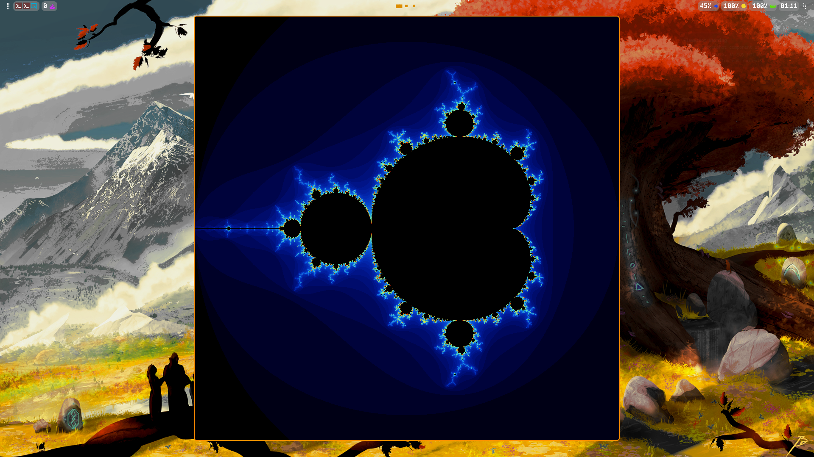

This is a very simple visualizer for the **Mandelbrot set**. This project is written in c and uses **SDL3**.

# Screenshots

# Installation

This project is using the **SDL3 (Simple DirectMedia Layer)** library. Install the library using your preferred package manager. For example on **Arch Linux**:

    sudo pacman -S sdl3

Clone the repository:

    git clone https://github.com/bennior/mandelbrot-set
    cd mandelbrot-set

Build the executable with make.
